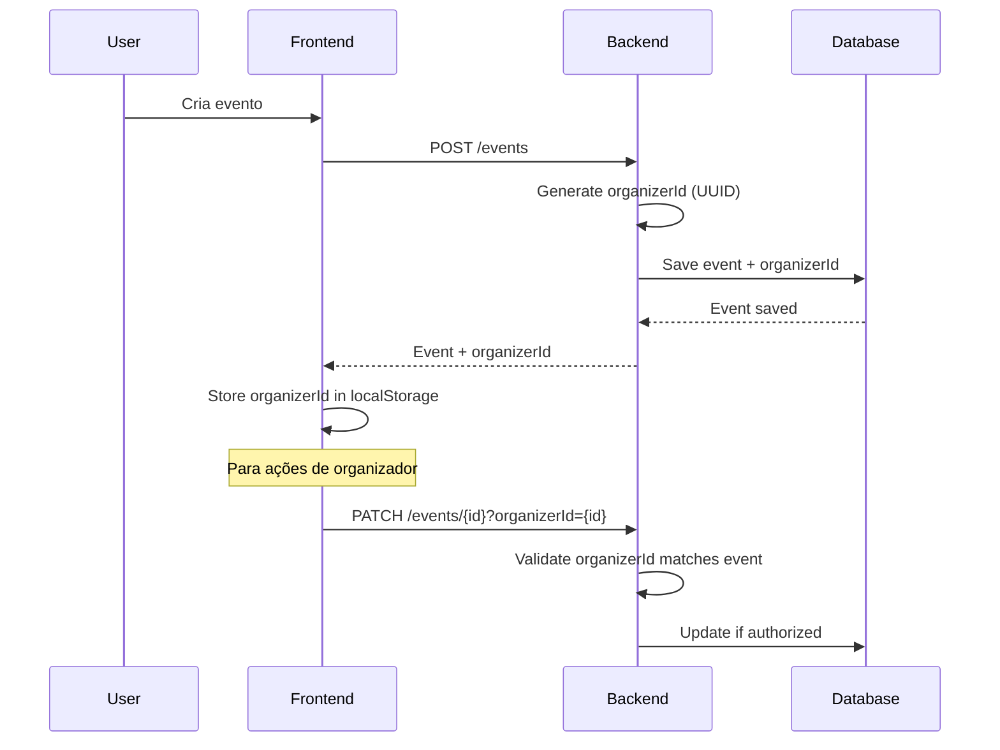

# Backend Architecture

## Service Architecture

### Controller Organization

```
src/
├── controllers/
│   ├── eventController.js
│   ├── guestController.js
│   ├── itemController.js
│   └── calculationController.js
├── models/
│   ├── Event.js
│   ├── Guest.js
│   └── EventItem.js
├── routes/
│   ├── events.js
│   ├── guests.js
│   └── index.js
├── services/
│   ├── eventService.js
│   ├── costCalculator.js
│   └── linkGenerator.js
├── middleware/
│   ├── validation.js
│   ├── errorHandler.js
│   └── cors.js
└── utils/
    ├── database.js
    └── helpers.js
```

### Controller Template

```javascript
// controllers/eventController.js
const Event = require('../models/Event');
const { validationResult } = require('express-validator');

const eventController = {
  async createEvent(req, res, next) {
    try {
      const errors = validationResult(req);
      if (!errors.isEmpty()) {
        return res.status(400).json({ error: { message: 'Validation error', details: errors.array() } });
      }

      const eventData = req.body;
      const event = await Event.create(eventData);
      
      res.status(201).json(event);
    } catch (error) {
      next(error);
    }
  },

  async getEvent(req, res, next) {
    try {
      const { eventId } = req.params;
      const event = await Event.findByPublicId(eventId);
      
      if (!event) {
        return res.status(404).json({ error: { message: 'Event not found' } });
      }
      
      res.json(event);
    } catch (error) {
      next(error);
    }
  }
};

module.exports = eventController;
```

## Database Architecture

### Schema Design

```javascript
// models/Event.js
const mongoose = require('mongoose');
const { v4: uuidv4 } = require('uuid');

const eventSchema = new mongoose.Schema({
  id: {
    type: String,
    default: uuidv4,
    unique: true,
    index: true
  },
  name: {
    type: String,
    required: true,
    trim: true
  },
  date: {
    type: Date,
    required: true
  },
  location: {
    type: String,
    required: true,
    trim: true
  },
  organizerId: {
    type: String,
    required: true,
    index: true
  },
  status: {
    type: String,
    enum: ['draft', 'active', 'completed', 'cancelled'],
    default: 'draft'
  },
  confirmationDeadline: Date,
  estimatedParticipants: {
    type: Number,
    required: true,
    min: 1,
    max: 50
  }
}, {
  timestamps: true
});

eventSchema.statics.findByPublicId = function(publicId) {
  return this.findOne({ id: publicId });
};

module.exports = mongoose.model('Event', eventSchema);
```

### Data Access Layer

```javascript
// services/eventService.js
const Event = require('../models/Event');
const EventItem = require('../models/EventItem');
const Guest = require('../models/Guest');

const eventService = {
  async createEvent(eventData) {
    const event = new Event(eventData);
    await event.save();
    
    // Create template items
    await this.createTemplateItems(event.id);
    
    return event;
  },

  async createTemplateItems(eventId) {
    const templateItems = [
      { name: 'Carne bovina', category: 'carne', quantity: 1, unit: 'kg', estimatedCost: 6000, isTemplate: true },
      { name: 'Cerveja', category: 'bebidas', quantity: 12, unit: 'latas', estimatedCost: 3000, isTemplate: true },
      { name: 'Carvão', category: 'carvao', quantity: 1, unit: 'saco', estimatedCost: 1000, isTemplate: true },
      { name: 'Pão de alho', category: 'acompanhamentos', quantity: 2, unit: 'unidades', estimatedCost: 800, isTemplate: true }
    ];

    const items = templateItems.map(item => ({
      ...item,
      eventId,
      isPurchased: false
    }));

    await EventItem.insertMany(items);
  },

  async getEventWithDetails(eventId) {
    const event = await Event.findByPublicId(eventId);
    if (!event) return null;

    const [items, guests] = await Promise.all([
      EventItem.find({ eventId }),
      Guest.find({ eventId })
    ]);

    return { ...event.toObject(), items, guests };
  }
};

module.exports = eventService;
```

## Authentication and Authorization

### Auth Flow



### Middleware/Guards

```javascript
// middleware/auth.js
const authMiddleware = {
  requireOrganizer: async (req, res, next) => {
    try {
      const { eventId } = req.params;
      const { organizerId } = req.query;
      
      if (!organizerId) {
        return res.status(403).json({ 
          error: { message: 'Organizer ID required' } 
        });
      }
      
      const Event = require('../models/Event');
      const event = await Event.findOne({ 
        id: eventId, 
        organizerId: organizerId 
      });
      
      if (!event) {
        return res.status(403).json({ 
          error: { message: 'Not authorized' } 
        });
      }
      
      req.event = event;
      next();
    } catch (error) {
      next(error);
    }
  }
};

module.exports = authMiddleware;
```
