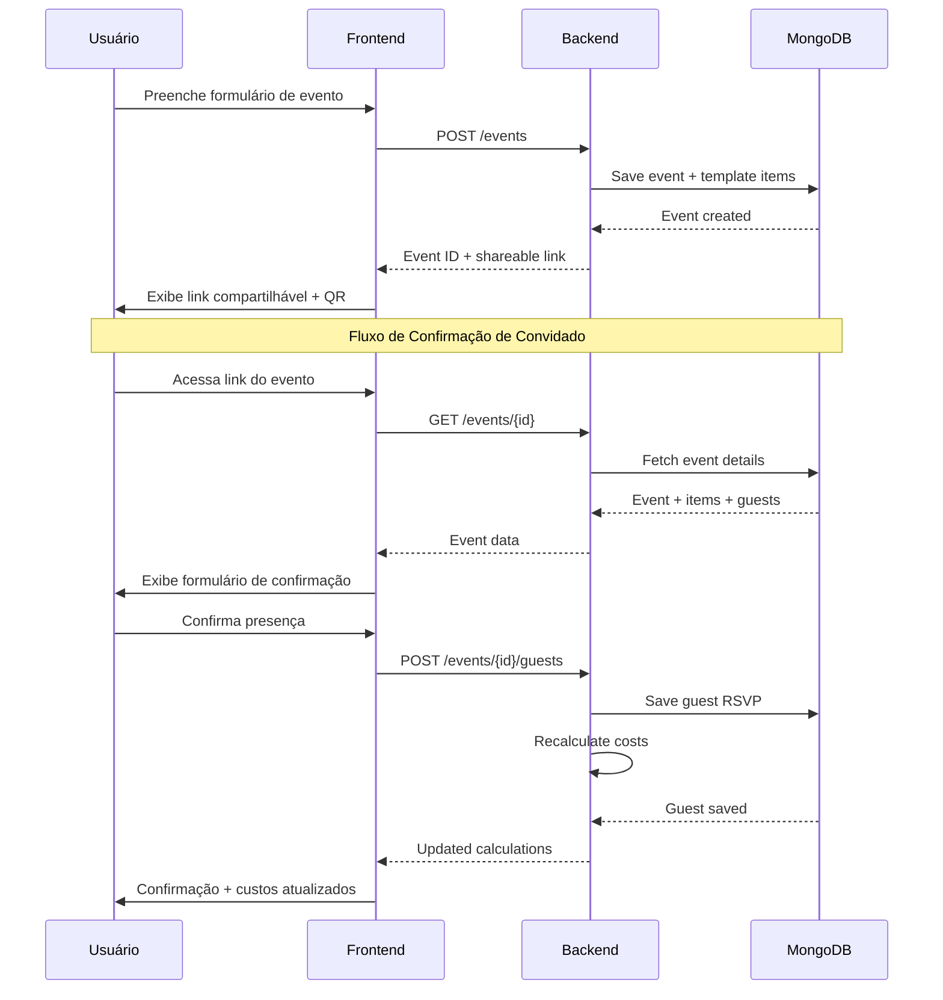

# Core Workflows

## Workflow de Criação e Confirmação de Evento

```mermaid
sequenceDiagram
    participant U as Usuário
    participant F as Frontend
    participant B as Backend
    participant DB as MongoDB
    
    U->>F: Preenche formulário de evento
    F->>B: POST /events
    B->>DB: Save event + template items
    DB-->>B: Event created
    B-->>F: Event ID + shareable link
    F->>U: Exibe link compartilhável + QR
    
    Note over U,DB: Fluxo de Confirmação de Convidado
    
    U->>F: Acessa link do evento
    F->>B: GET /events/{id}
    B->>DB: Fetch event details
    DB-->>B: Event + items + guests
    B-->>F: Event data
    F->>U: Exibe formulário de confirmação
    
    U->>F: Confirma presença
    F->>B: POST /events/{id}/guests
    B->>DB: Save guest RSVP
    B->>B: Recalculate costs
    DB-->>B: Guest saved
    B-->>F: Updated calculations
    F->>U: Confirmação + custos atualizados
```
