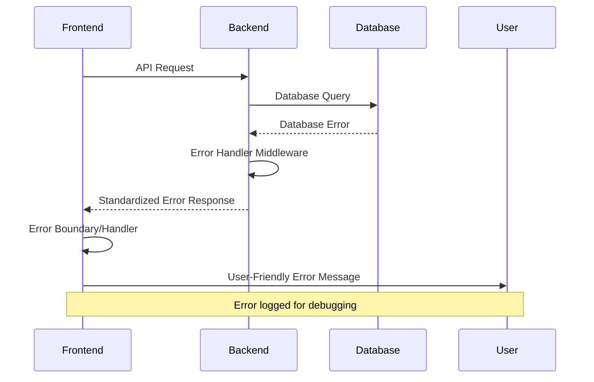

# Error Handling Strategy

## Error Flow



## Error Response Format

```javascript
// Formato padrão de erro da API
const ApiError = {
  error: {
    code: String,        // "VALIDATION_ERROR", "NOT_FOUND", etc.
    message: String,     // Mensagem legível para usuário
    details: Object,     // Detalhes adicionais (ex: campos inválidos)
    timestamp: String,   // ISO timestamp
    requestId: String    // UUID para tracking
  }
};
```

## Frontend Error Handling

```javascript
// utils/errorHandler.js
export const errorHandler = {
  handleApiError(error) {
    // Log para debugging
    console.error('API Error:', error);
    
    // Traduzir erros para português
    const errorMessages = {
      'VALIDATION_ERROR': 'Dados inválidos. Verifique os campos.',
      'NOT_FOUND': 'Evento não encontrado.',
      'NETWORK_ERROR': 'Erro de conexão. Tente novamente.',
      'DEFAULT': 'Algo deu errado. Tente novamente em alguns minutos.'
    };
    
    const code = error.error?.code || 'DEFAULT';
    return errorMessages[code] || errorMessages.DEFAULT;
  },

  async handleAsyncError(asyncFn, fallbackValue = null) {
    try {
      return await asyncFn();
    } catch (error) {
      const message = this.handleApiError(error);
      // Pode mostrar toast, notification, etc.
      return fallbackValue;
    }
  }
};

// Uso em componentes
const EventForm = () => {
  const [error, setError] = useState(null);
  
  const handleSubmit = async (data) => {
    const result = await errorHandler.handleAsyncError(
      () => eventService.createEvent(data)
    );
    
    if (!result) {
      setError('Não foi possível criar o evento');
    }
  };
};
```

## Backend Error Handling

```javascript
// middleware/errorHandler.js
const { v4: uuidv4 } = require('uuid');

const errorHandler = (err, req, res, next) => {
  const requestId = uuidv4();
  
  // Log completo para debugging
  console.error(`[${requestId}] Error:`, {
    message: err.message,
    stack: err.stack,
    url: req.url,
    method: req.method,
    body: req.body
  });
  
  // Resposta padronizada
  const errorResponse = {
    error: {
      code: err.code || 'INTERNAL_SERVER_ERROR',
      message: err.message || 'Erro interno do servidor',
      details: err.details || {},
      timestamp: new Date().toISOString(),
      requestId
    }
  };
  
  // Status code baseado no tipo de erro
  const statusCode = err.statusCode || 500;
  
  res.status(statusCode).json(errorResponse);
};

// Custom error classes
class ValidationError extends Error {
  constructor(message, details = {}) {
    super(message);
    this.code = 'VALIDATION_ERROR';
    this.statusCode = 400;
    this.details = details;
  }
}

class NotFoundError extends Error {
  constructor(message = 'Resource not found') {
    super(message);
    this.code = 'NOT_FOUND';
    this.statusCode = 404;
  }
}

module.exports = { errorHandler, ValidationError, NotFoundError };
```
