# High Level Architecture

## Technical Summary

ChurrasApp adota uma arquitetura monolítica simples com frontend React.js e backend Node.js/Express, deployados na plataforma Render para máxima simplicidade operacional. O frontend utiliza state management nativo do React e comunicação via Fetch API, enquanto o backend oferece APIs REST com armazenamento MongoDB. A integração acontece através de endpoints RESTful simples, priorizando velocidade de desenvolvimento sobre sofisticação técnica. Esta arquitetura suporta até 50 participantes por evento com carregamento sub-3s em 3G, atendendo perfeitamente aos objetivos de simplicidade e democratização de acesso do PRD.

## Platform and Infrastructure Choice

**Platform:** Render (frontend e backend na mesma plataforma)
**Key Services:** Render Web Service (frontend estático), Render Web Service (backend Node.js), Render MongoDB
**Deployment Host and Regions:** US-West/US-East (escolha automática), com CDN global do Render

## Repository Structure

**Structure:** Monorepo com separação clara frontend/backend
**Monorepo Tool:** npm workspaces (nativo, sem ferramentas extras)
**Package Organization:** 
- `/frontend` - React app independente
- `/backend` - Express server independente
- `/shared` - tipos e utilitários comuns (opcional para JavaScript)

## High Level Architecture Diagram

```mermaid
graph TB
    subgraph "User Access"
        U[👤 Usuários Mobile/Desktop]
        QR[📱 QR Code Sharing]
    end
    
    subgraph "Frontend Layer (Render)"
        WEB[🌐 React.js App<br/>Static Site]
        PWA[📱 PWA Features]
    end
    
    subgraph "Backend Layer (Render)"
        API[🔧 Express API Server<br/>Node.js]
        CALC[🧮 Cost Calculator]
        SHARE[🔗 Link Generator]
    end
    
    subgraph "Data Layer"
        MONGO[🍃 MongoDB<br/>Render Database]
        FILES[📁 File Storage<br/>Local/Temp]
    end
    
    subgraph "External Services"
        WA[📱 WhatsApp Integration]
        QRG[🔲 QR Code Generator]
    end
    
    U --> WEB
    QR --> WEB
    WEB --> API
    API --> CALC
    API --> SHARE
    API --> MONGO
    API --> FILES
    WEB --> WA
    WEB --> QRG
    
    PWA -.-> WEB
```

## Architectural Patterns

- **Jamstack Architecture:** Frontend estático com APIs serverless - _Rationale:_ Performance máxima e custo mínimo para MVP com baixo tráfego inicial
- **Component-Based UI:** Componentes React reutilizáveis sem TypeScript - _Rationale:_ Desenvolvimento rápido mantendo organização e reutilização
- **Repository Pattern:** Abstração de acesso a dados no backend - _Rationale:_ Facilita migração futura entre diferentes bancos de dados
- **API Gateway Pattern:** Express como ponto único de entrada - _Rationale:_ Centraliza validação, CORS e rate limiting básico
- **Mobile-First Design:** Interface responsiva partindo de 320px - _Rationale:_ Atende público-alvo de todas as classes sociais com devices variados
- **Stateless Backend:** APIs REST sem sessões complexas - _Rationale:_ Simplicidade operacional e facilidade de debug
- **Progressive Enhancement:** Funcionalidades básicas sempre disponíveis - _Rationale:_ Garante usabilidade em conexões 3G e dispositivos básicos
